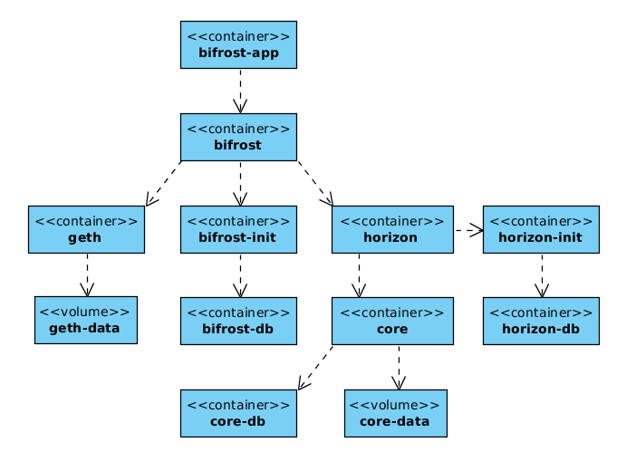

# Bifrost deployment

Kind of deployment automation for Bifrost

## Docker Compose prototype
### Prerequisites

**BEWARE**: in this repo [git-submodules](https://github.com/blog/2104-working-with-submodules) are used!

Initial checkout:
```text
git clone --recursive git@github.com:otokarev/k8s-deployment-bifrost.git
```

or run after `git clone` from project folder:
```text
git submodule update --init --recursive
```

### Test Environment for workstation

The project is supplied with Vagrantfile/playbook.yml (VirtualBox/Ansible/Vagrant required) to install isolated virtual server to test Docker Compose deployment inside of it.

```text
vagrant up

```
**BEWARE:** virtual box storage is only 10G, resize it to 30G as described here (http://tuhrig.de/resizing-vagrant-box-disk-space/, https://tech.enekochan.com/en/2014/09/17/fix-vboxmanage-error-cannot-register-the-hard-disk-because-a-hard-disk-already-exists/)

### Docker Compose based deployment



**Services**
* **bifrost-app** WEB UI Node.js app designed to demonstrate Bifrost main use-case
* **bifrost** Main Bifrost daemon
* **geth** Geth - Ethereum node
* **geth-data** - the place eth node stores its data
* **bifrost-init** - the service initializing Bifrost DB 
* **bifrost-db** - Bitfrost DB
* **horizon** - Stellar Horizon server
* **horizon-proxy** - Stellar Horizon behind HTTPS (nginx)
* **horizon-init** - the service initializing Horizon DB
* **horizon-db** - Horizon DB
* **core** - Stellar Core server
* **core-data** - Stellar Core data volume
* **core-db** - Stellar Core DB

Files:
* `docker-compose.yaml` is a playbook to deploy bifrost related Docker containers through `docker-compose`

Run from project folder or `/vagrant` if the mentioned above vagrant box was installed
```text
docker-compose up
```
## Kubernates 
### Credentials
Create a service account with `Cloud SQL Client` role. Store json-file with private key localy (e.g. in `stellar-sql-client-key.json`)

Update SSL certificate and certificate key stored as:
* `volumes/horizon/certs/cert.crt`
* `volumes/horizon/certs/cert.key`

or use existing ones (for test purpose only!)
### Configurations
```text
cd ansible
cp host_vars/localhost.sample host_vars/localhost
```

Minimal `host_vars/localhost` update to be able run playbook:

* `stellar_core_image` must refer to image based on - https://github.com/otokarev/docker-stellar-core
* `stellar_horizon_image` must refer to image based on - https://github.com/otokarev/docker-stellar-horizon
* `stellar_bifrost_image` must refer to image based on - https://github.com/otokarev/docker-stellar-bifrost
* `stellar_bifrost_client_image` must refer to image based on - https://github.com/otokarev/docker-stellar-bifrost-client

* `project` your existing project ID

* `sql_instance_id` instance ID for *new* SQL instance, make sure it will not collide with other instance's ID


### Deployment
Deploy the application (including SQL instance, cluster, etc)
```
cd ansible
ansible-playbook -i localhost deploy.yml
```
Remove the application, cluster, SQL instance
```text
cd ansible
ansible-playbook -i localhost deploy.yml
```

###Maintenance
Pod cannot be launched if disk `core-data` is attached to any compute. To detach run in console:
```text
for i in `gcloud compute instances list | gawk 'NR>1 {print $1}'`; do gcloud compute instances detach-disk $i --zone $ZONE --disk=core-data; done
```

To modify the deployment:
```
kubectl edit deployment/stellar --save-config
```
To see logs (stellar core):
```
kubectl log deployment/stellar -c core -f
```
To see logs (stellar horizon):
```
kubectl log deployment/stellar -c horizon -f
```
Delete the deployment:
```text
kubectl delete deployment stellar
```
Delete the service:
```text
kubectl delete service stellar
```
Launch bash in Stellar core container:
```text
kubectl exec -it `kubectl get pods -o go-template="{{ (index .items 0).metadata.name }}"` -c core sh
```
Describe first pod from the list:
```text
kubectl describe  po/`kubectl get pods -o go-template="{{ (index .items 0).metadata.name }}"`
```
Get logs for `stellar-horizon`:
```text
kubectl logs `kubectl get pods -o go-template="{{ (index .items 0).metadata.name }}"` horizon -f
```

Delete all PVs with label `service` equal to `geth`
```text
kubectl get pv -l 'service=geth' -o go-template='{{range .items }}{{.metadata.name}} {{end}}' | xargs kubectl delete pv
```
