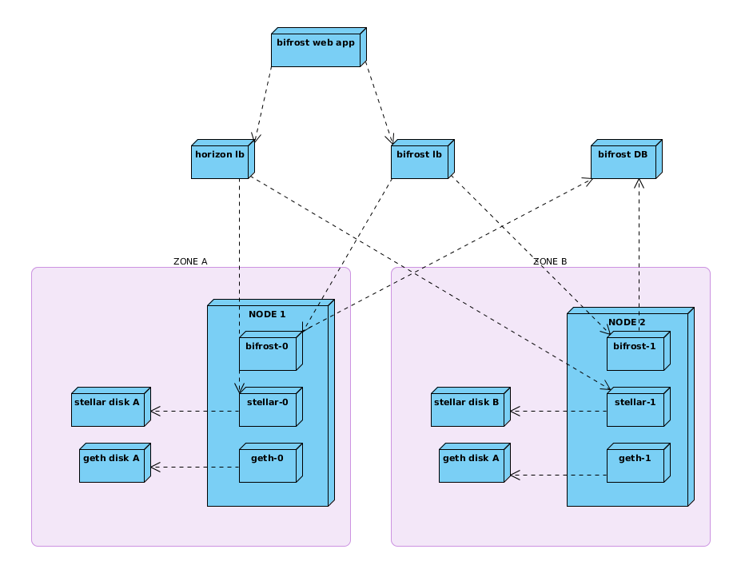

Kind of deployment automation for Bifrost

# Kubernates 
## Component Diagram


## Prerequisites
* `Ansible` >= 2.4
* `kubectl` v1.7.5 installed (can be downloaded as `curl -LO https://storage.googleapis.com/kubernetes-release/release/v1.7.5/bin/linux/amd64/kubectl`)
* `google-cloud-sdk` installed, `gcloud` configured to have access the target project
* Create a service account with `Cloud SQL Client` role. Store json-file with private key localy (e.g. in `stellar-sql-client-key.json`)
* Get somewhere SSL certificate and certificate key and store them locally.
  
  Or use existing ones (for test purpose only!):
  * `files/certs/cert.crt`
  * `files/certs/cert.key`

## Initial Configurations
Copy `group_vars/dev.sample` to `group_vars/dev`

Change it. Set appropriate settings.

**CAUTION:** Database in `stellar-core.cfg` must be configures as
```text
DATABASE="__DATABASE_URL__"`
```

## Kubernetes Panel

Run in console
```text
kubectl proxy
```

After that a web console available at `http://127.0.0.1:8001/ui` (choose right namespace to see something)

## Maintenance
### Cluster
Deploy a cluster
```
ansible-playbook -i dev playbooks/deploy-cluster.yml 
```

Deploy letsencript controller
```$xslt
ansible-playbook -i dev ./playbooks/deploy-letsencrypt.yml
```

Drop the cluster (drops cluster only, leaves IPs, disks untouched)
```
ansible-playbook -i dev playbooks/drop-cluster.yml 
```
### Common
Deploy all applications in the cluster
```
ansible-playbook -i dev playbooks/deploy-all.yml 
```
It safe to run it several times. The tasks processed before will not block playbook processing.

Drop all apps
```
ansible-playbook -i dev playbooks/drop-all.yml 
```

By default `playbooks/drop-*` does not destroy disks, secrets and IPs.
 * To force disks deletion use `-e force_disks_drop=1`
 * To force IPs deletion use `-e force_ips_drop=1`
 * To force secrets deletion use `-e force_secrets_drop=1`

Example:
```
ansible-playbook -i dev playbooks/drop-stellar.yml -e force_ips_drop=1 -e force_disks_drop=1
```

### Geth
Deploy `geth` only
```
ansible-playbook -i dev playbooks/deploy-geth.yml 
```
Drop `geth` only
```
ansible-playbook -i dev playbooks/drop-geth.yml 
```
### Stellar
#### Deploy `stellar` only

Prerequisites:
1. `stellar_domain_name` domain must be managed by Google Cloud DNS

```
ansible-playbook -i dev playbooks/deploy-stellar.yml 
```
Manually update `stellar_domain_name`s IP through Google Cloud Console

#### Drop `stellar` only
```
ansible-playbook -i dev playbooks/drop-stellar.yml 
```

#### Change Stellar Core configuration (`stellar-core.cfg`) procedure:
* modify `stellar-core.cfg`
* increment `stellar_core_config_version` in `group_vars` file
* Run `ansible-playbook -i dev playbooks/deploy-stellar.yml`

Troubleshooting (if Stellar falls to erroneous state after the config change):
* Rollback:
  * Assign `stellar_core_config_version` by previous value
  * Run `ansible-playbook -i dev playbooks/deploy-stellar.yml`
* Or:
  * Correct `stellar-core.cfg`
  * increment `stellar_core_config_version` in `group_vars` file
  * Run `ansible-playbook -i dev playbooks/deploy-stellar.yml`

